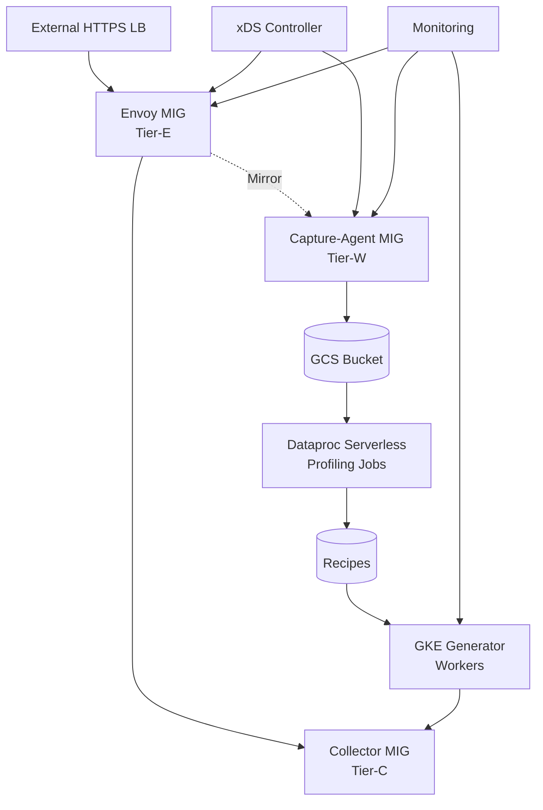

# Wavefront Load Generator

A near-real traffic generator that reproduces and scales customer Wavefront-format metric streams for internal development and load testing.

## Overview

This system captures live Wavefront traffic (≥50 TB/day), profiles it to create compact "Recipes", and then generates unlimited synthetic load on demand (1×–10×+). The architecture consists of:

- **Tier-E (Envoy MIG)**: Primary ingress + async mirroring
- **Tier-C (Collector MIG)**: Existing collectors (unchanged)  
- **Tier-W (Capture-Agent MIG)**: Mirror processing + GCS upload
- **Profiling Pipeline**: Spark jobs creating Recipes
- **Generator**: GKE workers synthesizing traffic

## Architecture



## Wavefront Format Support

- **Metrics**: `<metricName> <metricValue> [<timestamp>] source=<source> [pointTags]`
- **Delta Counters**: Metrics prefixed with `∆` or `Δ` (minute binning)
- **Histograms**: `!M|!H|!D [<timestamp>] #<count> <centroid>...` + metric line
- **Spans**: `<operationName> source=<source> <spanTags> <start_ms> <duration_ms>` (optional)

## Quick Start

1. **Deploy Infrastructure**:
   ```bash
   cd infra/
   terraform init && terraform apply
   ```

2. **Enable Capture**:
   ```bash
   # Start with 5% mirroring
   kubectl patch configmap xds-config --patch '{"data":{"capture.enabled":"5"}}'
   ```

3. **Run Profiling** (after 24h capture):
   ```bash
   cd profiling/
   ./submit-profiling-job.sh
   ```

4. **Generate Traffic**:
   ```bash
   kubectl apply -f generator/manifests/
   # Scale to 2x original load
   kubectl patch loadscenario default --patch '{"spec":{"multiplier":2.0}}'
   ```

## Directory Structure

- `docs/` - Architecture docs and runbooks
- `infra/` - Terraform for MIGs, xDS controller, GKE
- `profiling/` - Spark jobs and Recipe schemas  
- `generator/` - Control plane and worker pods
- `validation/` - Metrics and divergence monitoring

## SLOs

- **Latency Impact**: < 2ms p95 added by Envoy mirroring
- **Capture Throughput**: ~116 MB/s compressed to GCS  
- **Backlog**: ≤ 10s queue depth on Tier-W
- **Recipe Coverage**: > 99% of metric families profiled
- **Load Fidelity**: Generated traffic within ±5% of target, divergence thresholds met

## Security

- All components use dedicated service accounts with minimal IAM
- Raw capture data deleted after successful profiling
- Same-region private networking with Private Google Access
- No internal load balancers (xDS-based discovery only)

## Monitoring

- **Dashboards**: Grafana dashboards for all tiers + divergence metrics
- **Alerts**: Backlog, error rates, divergence thresholds
- **SLIs**: Latency impact, throughput, coverage, fidelity

See `docs/` for detailed design documents and `docs/runbooks/` for operational procedures.