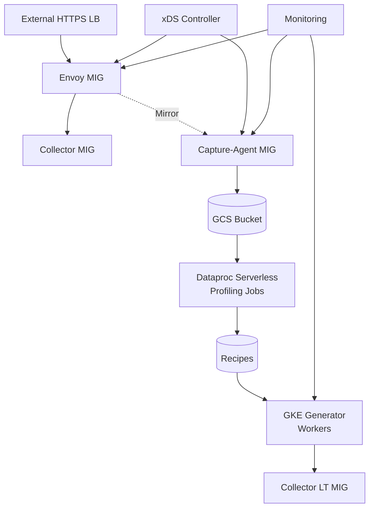

# System Architecture Design

## Overview

The Wavefront Load Generator is a near-real traffic reproduction system designed to capture, profile, and synthesize metric streams at scale (≥50 TB/day). The system operates in three phases:

1. **Capture Phase**: Mirror live traffic for 24 hours using dedicated MIGs
2. **Profiling Phase**: Extract statistical profiles ("Recipes") using Spark
3. **Generation Phase**: Synthesize unlimited realistic load using GKE workers

## Architecture Principles

- **No Internal Load Balancers**: All discovery via xDS (EDS/RTDS)
- **Async Mirroring**: Primary path unaffected by capture failures  
- **Delete Raw Data**: Only retain compact Recipes after profiling
- **Wavefront Native**: Honor all format semantics (deltas, histograms, spans)
- **Horizontal Scale**: All tiers auto-scale based on load/backlog

## Architecture



## Component Architecture

### Envoy MIG (Proxy + Mirror)

**Purpose**: Primary ingress proxy with async traffic mirroring capability

**Key Features**:
- Receives external HTTPS traffic, terminates at external LB
- Routes primary traffic to existing Collector MIG
- Asynchronously mirrors requests to Capture-Agent MIG
- Runtime control via RTDS key `capture.enabled` (0-100%)
- Active health checks and outlier detection

**Technology**: Envoy Proxy with xDS management plane

**Scaling**: Fixed capacity or request-rate based autoscaling

**Dependencies**:
- xDS Controller for endpoint discovery
- Cloud Monitoring for metrics export

### Capture-Agent MIG (Mirror Processing)

**Purpose**: Process mirrored traffic and upload to GCS for profiling

**Key Features**:
- Receives HTTP mirrors from Envoy proxy
- Batches Wavefront lines in memory (256-512MB or 60s rotation)
- Zstd compression (level 3-5) with fsync before upload
- Resumable parallel GCS uploads (16 workers, 64-256MB chunks)
- Local spill to PD-SSD/Local SSD with backpressure

**Data Layout**:
```
gs://<bucket>/capture/dt=YYYY-MM-DD/mig=<Envoy>/<instance>/part-NNN.wf.zst
gs://<bucket>/capture/dt=YYYY-MM-DD/manifests/<instance>-manifest.jsonl
```

**Technology**: Go service with GCS client library

**Scaling**: Custom metrics on `backlog_seconds` (target ~8s)

**SLOs**:
- Upload rate: ~116 MB/s aggregate
- Backlog: ≤ 10s queue depth
- Mirror timeout: 100-200ms (no retries)

### xDS Controller

**Purpose**: Dynamic service discovery without internal load balancers

**Key Features**:
- Lists Compute Engine instances in MIGs via API
- Builds EDS clusters with locality-aware load balancing  
- Exposes RTDS key `capture.enabled` for runtime mirroring control
- Handles graceful VM draining (weight=0 for DELETING instances)
- Active health check configuration

**Technology**: Go service with Compute API and Envoy xDS libraries

**API Surface**:
- EDS: `collector_cluster`, `capture_cluster`  
- RTDS: `capture.enabled` percentage (0-100)

### Profiling Pipeline

**Purpose**: Transform raw capture data into compact statistical Recipes

**Key Components**:
1. **Parser**: Wavefront line format parsing with full semantic support
2. **Family Analyzer**: Group metrics by `hash(name + tag_keys)`  
3. **Statistical Profiler**: Distributions, co-occurrence, temporal patterns
4. **Recipe Generator**: Compact synthesis parameters
5. **QA Reporter**: Coverage metrics and validation

**Technology**: PySpark on Dataproc Serverless

**Input**: `gs://<bucket>/capture/dt=YYYY-MM-DD/**/*.wf.zst`

**Outputs**:
- `gs://<bucket>/recipes/v1/<family_hash>.json.zst` (per-family)
- `gs://<bucket>/recipes/index.parquet` (global catalog) 
- `gs://<bucket>/reports/profile_qa/*.html` (QA reports)
- `_PROFILE_OK` marker (triggers deletion)

**Wavefront Format Handling**:
- **Metrics**: `name value [timestamp] source=src [tags]`
- **Delta Counters**: `∆name` or `Δname` prefix detection
- **Histograms**: `!M|!H|!D` prefix parsing with centroid extraction
- **Spans**: Operation/source/tags/timing extraction (optional)

### Generator System

**Purpose**: Synthesize realistic Wavefront traffic from Recipes

**Architecture**:
- **Control Plane**: REST API + Kubernetes CRDs for scenario management
- **Worker Pods**: Go services that emit synthetic traffic
- **Recipe Store**: Shared Recipe access with hot-reload capability
- **Authentication Layer**: Connection pooling with socket-based auth management (lib-auth)

**Key Features**:
- **Traffic Models**: Non-homogeneous Poisson with intensity curves
- **Burst Support**: Hawkes process parameters for realistic burstiness
- **Schema Evolution**: Probabilistic tag drift and new field injection
- **Multi-Format**: Metrics, delta counters, histograms, spans synthesis
- **Size Fidelity**: Payload size distribution matching
- **Online Validation**: Real-time divergence monitoring
- **Connection Management**: Socket-based connection pooling with buffered writers
- **Simplified Metrics**: Map-based metrics tracking (Prometheus-compatible endpoint)

**Technology**: 
- Control Plane: Go with Kubernetes controller-runtime
- Workers: Go with HTTP client pools and socket connections
- Storage: GCS for Recipe access
- Auth: lib-auth package for connection management

**Scaling**: HPA on `bytes_emitted_per_sec` with PodDisruptionBudgets

## Data Flow

### Capture Flow
```
External Traffic → Envoy → Primary: Collectors
                       ↘ Mirror: Capture Agents → GCS
```

### Profiling Flow  
```
GCS Capture → Spark Jobs → Recipes + QA Reports → Delete Raw Data
```

### Generation Flow
```
Recipes → Control Plane → Worker Assignment → lib-auth → Socket Connections → Collectors
                                           ↘ Metrics Endpoint (:9090/metrics)
```

## Network Architecture

### Ingress Path
```
Internet → HTTPS Load Balancer → Envoy MIG → Collector MIG
                                         ↘ Capture MIG → GCS
```

### Internal Connectivity
- **No Internal Load Balancers**: All service discovery via xDS
- **Private Google Access**: GCS access without external IPs
- **Same-Region Deployment**: Minimize latency and egress costs
- **Health Check Paths**: `/health` on collectors, `/ready` on capture agents

### Security Boundaries
- **DMZ**: External LB to Envoy MIG (HTTPS terminated at LB)
- **Internal**: Plain HTTP between MIGs (private VPC)  
- **Storage**: GCS with IAM-based access control

## Scaling Characteristics

### Envoy
- **Capacity**: Fixed or request-rate based
- **Bottleneck**: CPU for TLS termination and mirroring logic
- **Target**: < 2ms p95 latency impact

### Capture
- **Capacity**: Custom metric on backlog seconds
- **Bottleneck**: GCS upload bandwidth and local storage
- **Target**: 8s average backlog with 116 MB/s aggregate throughput

### Generator
- **Capacity**: Horizontal pod autoscaler on emission rate
- **Bottleneck**: Network bandwidth and HTTP connection pools
- **Target**: Configurable QPS/MBps within ±5% accuracy

## Failure Modes

### Primary Path Protection
- Mirror failures never impact primary collector traffic
- Short timeouts (100-200ms) and no retries on mirror path
- Envoy continues operating if xDS controller unavailable

### Capture Resilience  
- Local spill to persistent disk prevents data loss
- Graceful degradation via `capture.enabled` throttling
- Auto-recovery after GCS connectivity restored  

### Generation Robustness
- Recipe versioning prevents incompatible updates
- Worker pods restart on Recipe reload failures
- Control plane maintains scenario state across restarts

## Monitoring & Observability

### Key Metrics
- **Latency Impact**: p95/p99 delta introduced by mirroring  
- **Capture Health**: backlog depth, upload rate, error count
- **Generation Fidelity**: divergence scores per metric family
- **Resource Utilization**: CPU/memory/disk across all tiers
- **Worker Metrics**: lines_emitted, bytes_emitted, http_errors (exposed via /metrics endpoint)

### Alerting Thresholds
- Backlog > 60s for > 5 minutes
- Upload rate < 80% expected for > 10 minutes  
- Mirror error rate > 1% for > 2 minutes
- Divergence red status for > 15 minutes

### Dashboards
- **Operations**: Real-time health across all tiers
- **Capacity**: Resource utilization and scaling triggers  
- **Quality**: Recipe coverage and generation fidelity

## Configuration Management

### Runtime Controls
- **RTDS**: `capture.enabled` percentage (0-100)
- **Load Scenarios**: Multiplier, burst factor, error injection
- **Recipe Updates**: Hot-reload without worker restart

### Infrastructure as Code
- **Terraform**: MIG templates, networks, IAM, GCS buckets
- **Packer**: VM images with pre-installed software
- **Kubernetes**: Generator deployment manifests and CRDs

This architecture provides a robust, scalable foundation for capturing and reproducing Wavefront traffic at massive scale while maintaining operational simplicity and cost efficiency.